# Customer Churning Analysis

  
Table of Contents

  <ol>
    <li>
      <a href="#about-the-project">About The Project</a>
      <ul>
        <li><a href="#built-with">Built With</a></li>
      </ul>
    </li>
    <li>
      <a href="#project-overview">Project Overview</a>
      <ul>
        <li><a href="#key_findings">Key Findings</a></li>
        <li><a href="#trends">Behavioral Trends</a></li>     
        <li><a href="#Revenue">Segmented Revenue Impact</a></li>    
      </ul>
    </li>
  </ol>

<!-- ABOUT THE PROJECT -->
## About The Project
This project analyzes customer churn using the Banking Customer Churn Prediction Dataset.Through data cleaning, feature engineering, exploratory analysis, and Tableau visualization, the goal is to uncover why customers leave and identify actionable strategies to reduce churn and revenue loss.

* Dataset: [Customer Churn](https://www.kaggle.com/datasets/saurabhbadole/bank-customer-churn-prediction-dataset)

(<a href="#readme-top">back to top</a>)

### Built With

* [![Python][Python.py]][Python-url]
* [![Pandas][Pandas]][Pandas-url]
* [![Seaborn][Seaborn]][Seaborn-url]
* [![Matplotlib][Matplotlib]][Matplotlib-url]

(<a href="#readme-top">back to top</a>)

<!-- GETTING STARTED -->
## Project Overview
This project includes:

* Complete **data cleaning** and preprocessing pipeline using Python
* Extensive **feature engineering** (risk buckets, salary brackets, tenure groups, balance/salary ratios, behavioral flags)
* **Churn pattern analysis** across geography, products, age groups, and genders
* **Behavioral segmentation** to uncover high-risk customer types
* **Financial impact evaluation** (revenue lost, CLV analysis)
* Interactive **Tableau dashboard** summarizing KPIs and insights

(<a href="#readme-top">back to top</a>)

## Key Findings
1. **Overall Churn Rate**
> How severe is the overall churn problem, and what proportion of our customer base is at risk?

* 20.37% of all customers churned (approximately 1 in 5 customers).

2. **Churn by Geography** 
> Which countries have the highest churn, and how should regional retention strategies differ?

* France: 16.17%
* Spain: 16.67%
* Germany: 32.52%

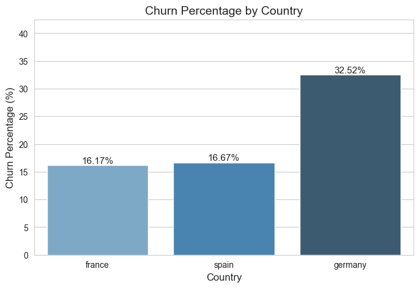

> **Insight:** Germany’s churn rate is nearly double that of France and Spain, indicating significant market-specific retention issues.

> **Action:** Deploy targeted campaigns in Germany, such as loyalty programs, personalized offers, or service enhancements.

3. **Churn by Tenure Group**
> Does customer tenure affect likelihood of churn, and which tenure group should we prioritize for retention?

* 0–2 years: 20.86%
* 3–5 years: 20.81%
* 6–10 years: 19.67%

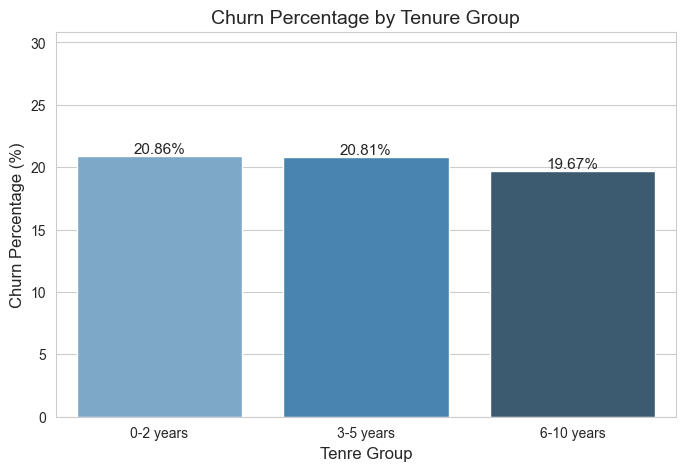

> **Insight:** Churn remains high across all tenure groups, with the highest churn in new customers (0–2 years) and slightly lower churn among long-term customers.

4. **Credit Score Impact on Churn**
> Does credit risk predict churn, and should interventions focus on certain risk groups?
* High risk: 22.17%
* Medium risk: 19.78%
* Low risk: 19.92%

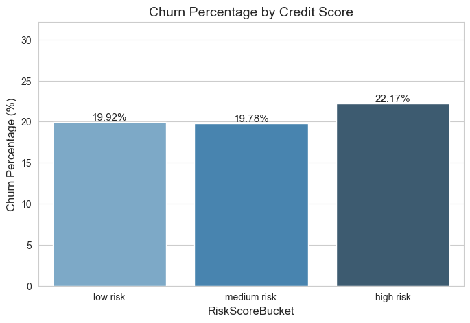

> **Insight:** High-risk customers churn the most, but the difference between medium and low risk is small.

* Credit score influences churn, but *it’s not the strongest driver* relative to geography or age.

> **Action:** Build predictive churn models to identify at-risk customers in real time and target them with retention campaigns.

5. **High vs. Low Balance Customers (Active Only)**
> Are high-balance active customers at higher risk of leaving, and what service improvements could retain them?

* Active high-balance customers churn: 17.93%
* Active low-balance customers churn: 10.69%

> **Insight:** Even among active customers, those with higher balances churn more. Which possibly indicates dissatisfaction with service or unmet expectations among higher-value clients.

6. **Churn by Gender & Age Group**
> Which gender and age groups are most at risk, and how can marketing and retention efforts be tailored?

* The **46–60** age group shows extremely high churn—especially women (**57%**) and men (**44.9%**).
* Younger customers (18–30) churn far less in comparison.
* Gender differences are pronounced, with **women in older age groups churning at the highest rates overall**.

> **Action:** Focus retention strategies on mid-career, high-value customers, especially older females, through targeted offers and relationship management.

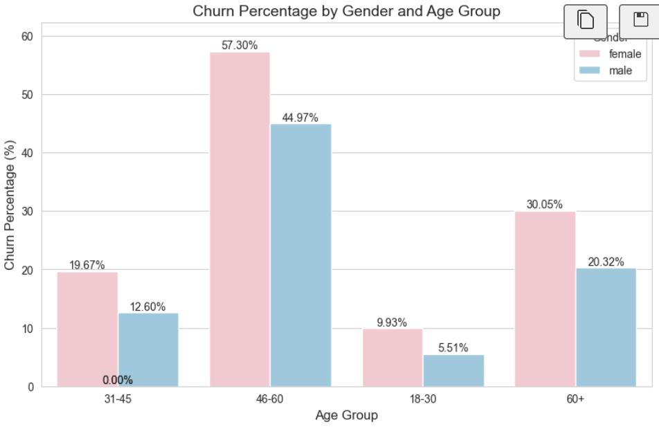

7. **Churn by Tenure and Age Group**

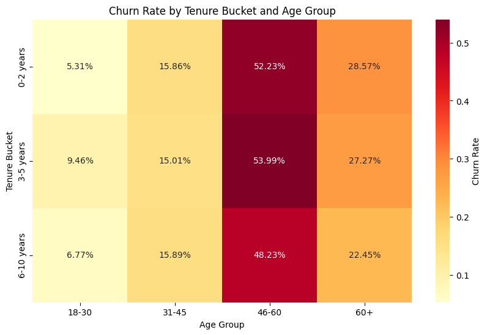

> **Insight:** Older mid-career customers (46–60) are at consistently higher risk of leaving, regardless of how long they’ve been with the bank. Young customers (18–30) are very loyal.

> **Action:** Design targeted retention strategies for high-risk age groups, particularly 46–60, with personalized offers, relationship management, or loyalty incentives.

(<a href="#readme-top">back to top</a>)

## Behavior Trends 
1. Are inactive members more likely to churn?
* Yes, inactive members show significantly higher churn, confirming that engagement is strongly tied to retention.

> How does customer activity level relate to churn, and which engagement strategies could reduce it?

> **Action:** Implement proactive engagement campaigns such as email reminders, personalized product suggestions, or incentives for activity.

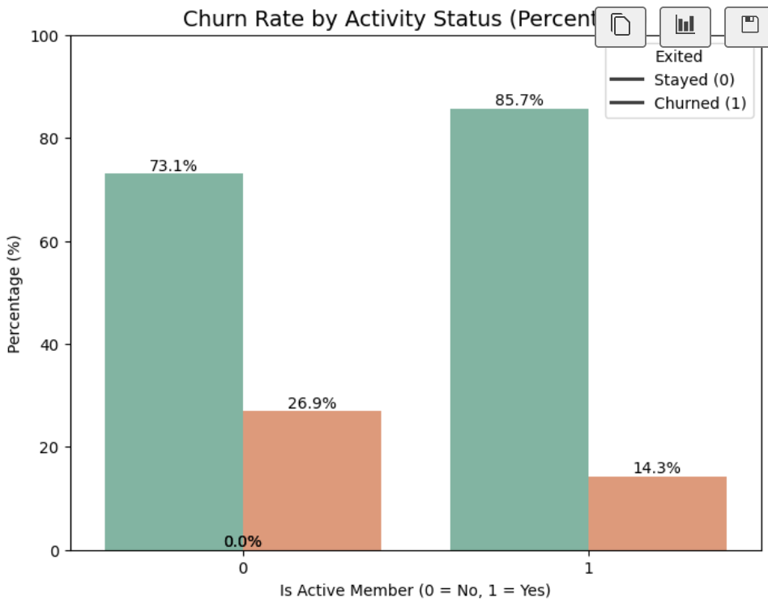

2. **High-Balance Customers Who Rarely Transact**
* Customers with high **BalanceSalaryRatio** showed higher churn.
* Suggests customers with large balances may feel **underserved**, lack advisory support, or have low product satisfaction.

> Does a large balance relative to salary indicate risk of churn, and how can we better serve these customers?

> **Action:** Provide premium services, personalized account management, or proactive engagement for high-balance clients.

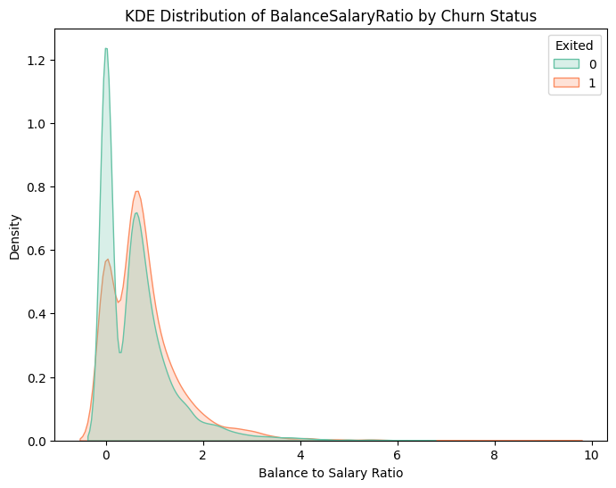

3. **Active Members With Low Product Engagement**
* Active customers with **few or only one product** show churn risk due to weak engagement.
* Customers with **1 or 2 products** mostly stayed, indicating these are stable groups.
* Customers with many products showed the highest churn, likely from: Product overload, poor bundling strategy, and complexity or dissatisfaction with multiple services

> Does product engagement influence churn, and how should product strategy adapt?

> **Action:** Simplify product offerings, review bundling strategies, and ensure clear communication of product benefits. Consider training or onboarding support for multi-product clients.

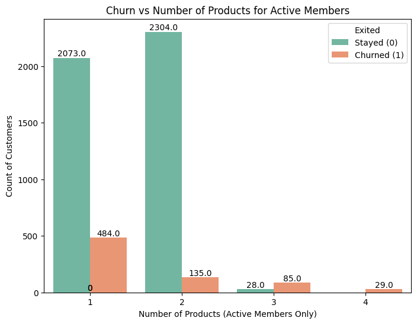

(<a href="#readme-top">back to top</a>)

## Financial Impact 
1. **How much revenue is the bank losing due to churn?**
* $206,570,186.77 lost based on estimated salaries of customers who exited.

2. **What is the financial cost per lost customer?**
* $101,508.69 per churned customer

3. **Are the customers who churn the most valuable, and how does this affect long-term profitability?**
* Avg CLV (churned customers): $508,413.35
* Avg CLV (retained customers): $502,003.46

> **Insight:** Churned customers had slightly higher CLV, suggesting the bank is losing some of its more valuable accounts.

(<a href="#readme-top">back to top</a>)

## Segmented Revenue Impact
1. **Revenue Lost by Geography**
> Which regions cause the highest financial impact when customers churn?

* **France**: highest revenue loss
* **Spain**: lowest revenue loss

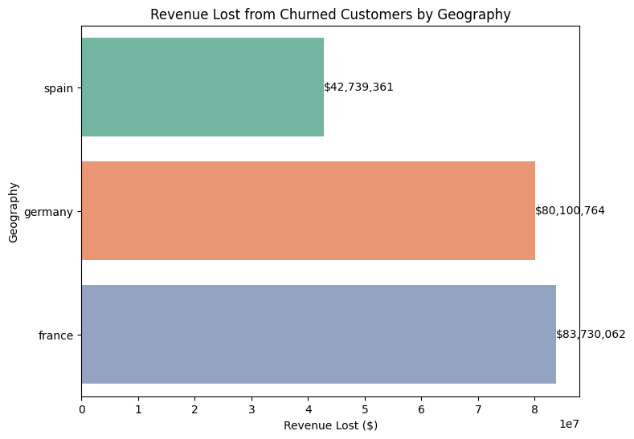

> **Insight:** Even though Spain and France have similar churn rates, France lost more revenue—possibly due to higher-income churners.

2. **Revenue Lost by Age Group**
> Which age segments are most financially impactful if they churn?

* 31–45: highest revenue lost
* 46–60: close second
* 18–30 and 60+: lowest revenue lost
- Mid-career professionals are the bank’s most financially significant churn segment.

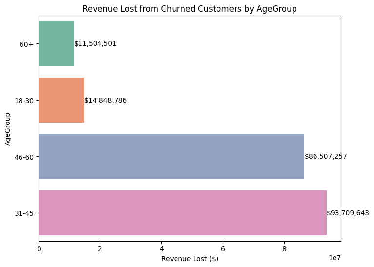

3. **Revenue Lost by Gender**
> Does gender affect revenue loss from churn?

* Females lost more revenue than males, aligning with higher churn in the 46–60 female segment.

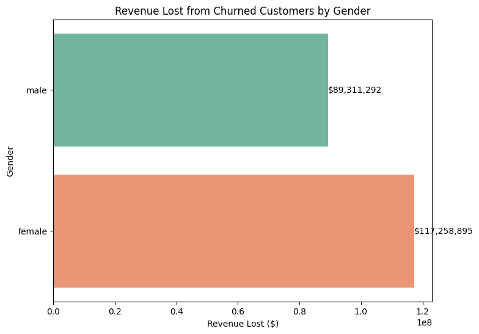

4. **Revenue Lost by Risk Bucket**
> How does credit risk segment influence financial losses due to churn?
* Medium risk customers lost the most revenue.
* High risk and low risk were fairly similar in revenue loss.

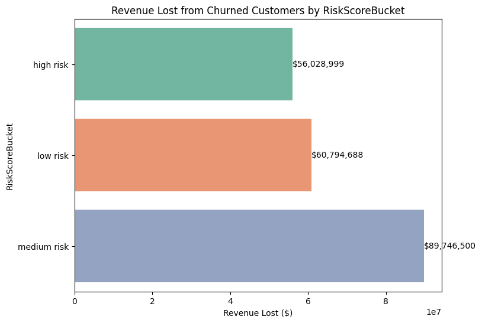

5. **Revenue Lost by Tenure**
> How does tenure influence financial impact, and which tenure groups require retention focus?
**Insight:** Revenue loss shows a U-shaped trend across tenure buckets; mid-tenure customers (3–7 years) contribute disproportionately to financial loss.

**Action:** Focus retention interventions on mid-tenure customers, including loyalty rewards, periodic account reviews, or personalized offers.
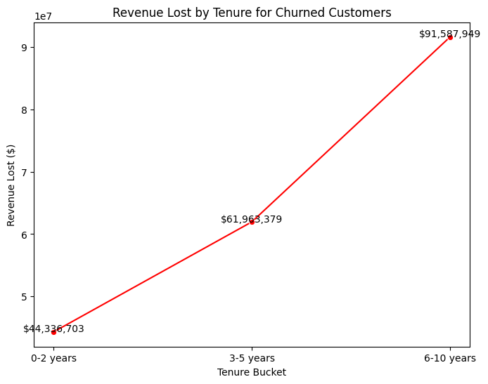
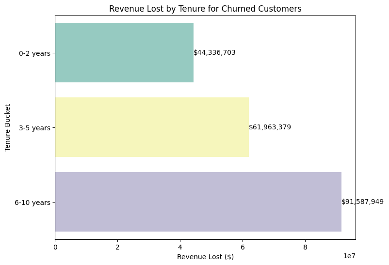

(<a href="#readme-top">back to top</a>)

[Python.py]: https://img.shields.io/badge/python-3776AB?style=for-the-badge&logo=python&logoColor=white
[Python-url]: https://www.python.org/
[Pandas]: https://img.shields.io/badge/pandas-150458?style=for-the-badge&logo=pandas&logoColor=white
[Pandas-url]: https://pandas.pydata.org/
[Seaborn]: https://img.shields.io/badge/seaborn-4C72B0?style=for-the-badge&logo=seaborn&logoColor=white
[Seaborn-url]: https://seaborn.pydata.org/
[Matplotlib]: https://img.shields.io/badge/matplotlib-11557C?style=for-the-badge&logo=matplotlib&logoColor=white
[Matplotlib-url]: https://matplotlib.org/

